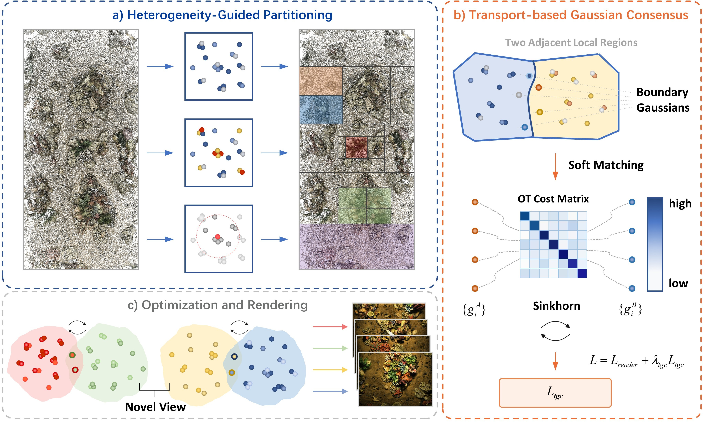

# HLCU

<div align="center">

## HLCU: Heterogeneity-Guided Local Consensus Gaussian Splatting for Underwater Reconstruction and Rendering

### 🎉 Accepted by ACCV 2026 🎉

</div>

---

## 🌊 Overview

**HLCU** is a Gaussian Splatting framework for underwater reconstruction and novel-view synthesis.

It consists of two key components:

- **Heterogeneity-Guided Partitioning (HGP)**  
  Adaptively partitions Gaussian primitives according to spatial distribution, gradient response, and local sparsity.

- **Transport-based Gaussian Consensus (TGC)**  
  Establishes soft correspondence between boundary Gaussians of neighboring local regions through optimal transport and Sinkhorn-based matching.

<p align="center">
  
</p>

<p align="center">
  <em>Overview of the proposed HLCU framework.</em>
</p>

---

## 🛠️ Environment

Our experiments are conducted with:

- Python 3.8.10
- PyTorch 2.1.2
- Torchvision 0.16.2
- CUDA 11.8
- NumPy 1.24.4
- Pillow 9.4.0
- OpenCV

Create the environment with:

```bash
conda env create -f environment.yaml
conda activate hlcu
```

---

## 📖 Citation

If you find this work useful, please consider citing:

```bibtex
@inproceedings{hlcu2026,
  title     = {HLCU: Heterogeneity-Guided Local Consensus Gaussian Splatting for Underwater Reconstruction and Rendering},
  author    = {Jiacheng Li and Ximan Zhao and Xuanhe Chu and Miaoxin Lu and Siyuan Liu},
  booktitle = {Proceedings of the Asian Conference on Computer Vision (ACCV)},
  year      = {2026}
}
```

The citation information will be updated after the official Springer proceedings are released.